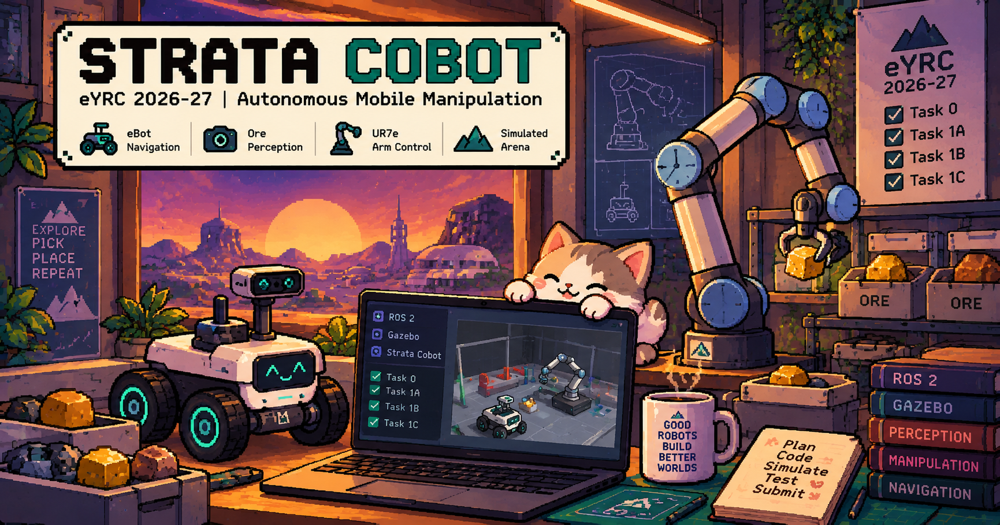

<p align="center">
  
</p>

<p align="center">
  
  
  
  
  
  
  
</p>

# e-Yantra Robotics Competition 2026-27 — StrataCobot (SC)

This repo is the official StrataCobot task repository with our Task 1 solutions added in
the `algorithms` package. All three are verified with the official evaluator:

| Task | What it does | Node | Evaluator |
|---|---|---|---|
| 1A: ore perception | Finds the 6 ores with the mast RealSense and broadcasts one TF per ore in `base_link` | `algorithms/scripts/task1a/task1a.py` | **20/20** |
| 1B: arm waypoints | Drives the UR7e tool through the 5 waypoints (twist servo), holding each 2 s | `algorithms/scripts/task1b/task1b.py` | **40/40** |
| 1C: eBot navigation | Follows `/ebot_path` and avoids rocks using `/scan` | `algorithms/scripts/task1c/task1c.py` | **40/40** |

**New here? Follow [`setup-guide.md`](setup-guide.md).** It covers everything from a fresh
Windows (WSL2) or Ubuntu machine to an evaluator run, plus troubleshooting.

## Quick start

On a machine that already has ROS 2 Jazzy desktop-full installed:

```bash
mkdir -p ~/strata_ws/src && cd ~/strata_ws/src
git clone https://github.com/aad1tyaaaaa/strata-cobot.git eYRC_26-27_Strata-Cobot
cd eYRC_26-27_Strata-Cobot && ./requirements.sh
cd ~/strata_ws && colcon build --symlink-install && source install/setup.bash

# terminal 1                                          # terminal 2 (once the sim is up)
ros2 launch eyantra_kepler_colony task1b.launch.py    ros2 run algorithms task1b.py
```

Replace `1b` with `1a` or `1c` for the other tasks. Add `rviz:=false` and/or `gui:=false`
to any launch to run lighter or headless.

## Repository layout

```
assets/                README banner
algorithms/            our solution nodes (scripts/task1{a,b,c}/) + the original boilerplates
eyantra_kepler_colony/ arena world, models, task launch files
ur_description/        UR7e arm + mast RealSense description, servo controller
ebot_description/      eBot mobile base description
tools/                 offline self-checks: python3 tools/sim_task1{a,b,c}.py
eyrc-sc-evaluator      official evaluator (writes the signed result.zip)
requirements.sh        task dependency installer (on top of ROS 2 Jazzy)
setup-guide.md         full setup walkthrough
PROGRESS.md            design notes, the reasoning behind each node, current status
```

---

The sections below are the official task workflow, kept for reference.

## 1. Install the task dependencies

From this directory:

```bash
./requirements.sh
```

It installs what the task needs on top of an existing ROS 2 Jazzy. It does not install
ROS itself.

## 2. Build the workspace

```bash
cd ~/strata_ws
colcon build
source install/setup.bash
```

Add the `source` line to your `~/.bashrc`.

## 3. Start the simulation

Each task has its own launch file. Leave it running in its own terminal.

```bash
ros2 launch eyantra_kepler_colony task0.launch.py    # Task 0 — the whole arena
ros2 launch eyantra_kepler_colony task1a.launch.py   # Task 1A — ore perception
ros2 launch eyantra_kepler_colony task1b.launch.py   # Task 1B — arm waypoints
ros2 launch eyantra_kepler_colony task1c.launch.py   # Task 1C — eBot navigation
```

None of them starts a solution node. That part is the task.

## 4. Write and run a node

Code goes in the **`algorithms`** package. To start a new node, copy a boilerplate:

```bash
cd algorithms
cp boilerplate/task1b_boilerplate.py scripts/task1b/my_node.py
chmod +x scripts/task1b/my_node.py
```

Add its path (from the package root) to `SCRIPTS` in `algorithms/setup.py`, then rebuild
and run it. The executable name is the file name, `.py` included:

```bash
cd ~/strata_ws
colcon build --packages-select algorithms
source install/setup.bash
ros2 run algorithms my_node.py
```

* A file is not installed until it is in `SCRIPTS` **and** you have rebuilt.
* Without `chmod +x` it installs fine and then refuses to start.
* Without `--symlink-install`, `ros2 run` starts the **installed** copy, so rebuild after
  every edit.

`ros2 pkg executables algorithms` lists what is actually installed.

## 5. Run the evaluator

In a second terminal, with the simulation running and the workspace sourced:

```bash
./eyrc-sc-evaluator --task 1B --team-id <YOUR_TEAM_ID>
```

It checks your setup, prints `Ready` and records the run. **Start your node only after
`Ready`.** Press `q` when the run has finished (`Ctrl-C` if you are not on an interactive
terminal).

It writes a **`result.zip`** into a folder named for your team and subtask. Do not unpack
it, rebuild it or rename anything inside it. It is signed, and editing it makes it
unreadable.

## 6. Submit

Copy your node into the folder the evaluator wrote, **renamed as the task page says**,
compress the contents together, and upload that one archive.

```
SC#<team>_task1B.zip
  ├── result.zip          from the evaluator, untouched
  └── task1B.py           your node, renamed
```

**Take the archive name, the file names and the full list of contents from the task
page.** They differ per subtask, and some subtasks ask for more than these two files.

---

The UR7e description in `ur_description` is modified by e-Yantra from the upstream
Universal Robots ROS 2 description; see `ur_description/LICENSE`.
